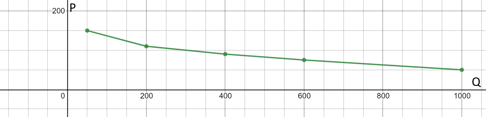

# ОТВЕТЫ НА ДАННЫЙ ТЕСТ
Здесь представлены ответы на этот тест №3.

# ГЛАВА 1. Механизм функционирования рыночной системы хозяйства.
Решите тесты, ответ обоснуйте

## 1.	Рынок существует:
### г) там, где спрос сталкивается с предложением и происходит обмен товарами.

Рынок существует исключительно там, где производители предлагают свои товары или услуги с целью получения прибыли, а покупатели приобретают данные экономические блага с целью удовлетворения потребностей, оплачивая их денежными средствами.

## 2.	Что из перечисленного не может рассматриваться как рыночная деятельность:
### в) выращивание овощей на приусадебном участке для собственного потребления; 

Рыночная деятельность связана с продажей экономических благ потребителю. В данном случае реализация продукции, производимой человеком на приусадебному участке, не может являться рыночной деятельностью, так как она не реализуется на рынке с целью получения прибыли.

## 3.	При классификации рынков на местный, региональный, национальный, международный (мировой) рынки главным критерием является:
### в) территориальный (географический) признак; 

Деление понятия "рынок" происходит в данном случает по географическому признаку. (пруф по ссылке: http://elibrary.sgu.ru/uch_lit/1287.pdf)

## 4.	Производство, ориентированное на рынок через систему купли-продажи товаров, является:
### б) товарное

Пруф: https://esperanto.mv.ru/wiki/Марксизм/ТоварноеПроизводство
Товарное производство — форма общественного производства, при которой продукты производятся не для собственного потребления, а для обмена (см. Товар); оно возникает на основе общественного разделения труда и ведётся экономически обособленными производителями

## 5.	При классификации рынков на легальный и нелегальный главным критерием является:
### б) степень соответствия законам; 

Легальный рынок - рынок, соответствующий законам страны или стран, на территории которой или которых он существует (Фондовые биржи).
Нелегальный рынок - рынок, который торгует запрещенными товарами или услугами на территории или территориях государств (Даркнет).

## 6.	К инфраструктуре рынка не относятся...
### в) научно-исследовательские институты;

НИИ не реализуют на рынке какие бы то ни было экономические блага. НИИ выполняют различные государственные заказы, занимаются научными исследованиями и разработками.

## 7.	Объектами рынка являются:
### г) правильными являются ответы б) и а).

Ответ А "товары и деньги". Ответ Б "факторы производства домашнего хозяйства".
Объекты рынка — материальные блага, факторы производства, ресурсы, товары и услуги, по поводу которых субъекты рынка вступают во взаимодействие, в рыночные отношения.

## 8.	Рыночный механизм можно охарактеризовать как:
### г) процесс реализации товаров и услуг;

Ры́нок — совокупность процессов и процедур, обеспечивающих обмен между покупателями (потребителями) и продавцами (поставщиками) отдельными товарами и услугами.

## 9.	Определите, что из перечисленного не относится к рыночному механизму:
### в) экономическое положение производителей и потребителей; 

Короче формулировку придумай сам: на рынке всем пофигу, как у кого с деньгами вопрос обстоит, всем интересно только что ты продаешь и что ты покупаешь.

# ГЛАВА 2. ПОСТРОЕНИЕ КРИВЫХ СПРОСА И ПРЕДЛОЖЕНИЯ, ИСХОДЯ ИЗ ФАКТИЧЕСКИХ И ГИПОТЕТИЧЕСКИХ ДАННЫХ

## ВАЖНЫЕ ОПРЕДЕЛЕНИЯ

**Неэластичный спрос** - Это такой спрос, при котором снижение цены приводит к такому увеличению объема продаж, что общая выручка снижается. (Товары первой необходимости)

**Эластичный спрос** - Это такой спрос, при котором снижение цены приводит к такому увеличению объема продаж, что общая выручка увеличивается.

_________

Еще пример из [ANews](https://anews.com/novosti/117279888-jelastichnosty-sprosa-i-predlozhenija-jelastichnyj-i-nejelastichnyj-spros-kojefficient-jelastichnosti.html):

**Ценовая эластичность спроса** - это чувствительность потребителей к изменению цены продукта.

Восприимчивость покупателей к ценам может быть разной. К примеру, повышение цен на квартиры на 10% - это очень сильный удар, она приведет к резкому сокращению сделок на рынке недвижимости. Это эластичный спрос.

А рост цен на спички на 10% почти не скажется на объемах продаж. Это неэластичный спрос.

## График А

**Объяснение**: Пусть ось Y это ось P (Price), а ось X - ось Q (Quantity). Тогда согласно указанным точкам можно построить такой график (см. картинку)

**Характер эластичности**: спрос эластичный, так как изменение цены товара повлияло на спрос, в данном случае цена выросла, а спрос упал.

Расчет оставил на всякий случай, не смотри сюда.

## График Б

**Характер зависимости:** обратный (цена выше - спрос ниже)

**Характер эластичности:** эластичный (меняется цена → меняется спрос)

Показать на графике и объяснить как изменилась величина спроса на автомобили не могу.

**ОСТАЛЬНЫЕ ГРАФИКИ ПРОПУСКАЮ**

# ГЛАВА 3. ТЕСТОВЫЕ ЗАДАНИЯ
## 1.	Если предложение и спрос на товар возрастают, то:
### o	цена повысится;

## 2.	Цена на товар может вырасти из-за:
### o	уменьшения предложения товара.

## 3.	Как вероятнее всего изменится положение точки равновесия при одновременном снижении себестоимости товара и увеличения доходов населения:
### o	равновесная цена и объем продаж увеличится.

## 4.	Цена на указанные товары и услуги уменьшилась на 30%. Величина спроса на ка- кой из них увеличится в большей степени:
### o	хлеб;

## 5.	Как изменится спрос на товар, если изменится цена на товар-субститут
###

